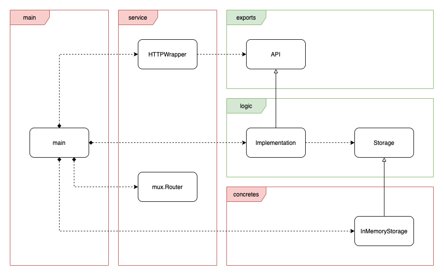

# Bureaucr.at

This repository holds a simple management system for the employees of Bureaucr.at.
The management system is available by means of a simple REST API.

## Scenarios

### Add a New Employee

This use case refers to adding new employees. A new employee can be added by providing
the name of their direct manager.

### Remove an Employee

This use case refers to removing employees. All the employees managed by the employee
to be removed can be transferred to a different manager, if a name for such a manager is
provided.

### Find Common Manager

This use case refers to finding the least senior manager that is common to two given
employees.

### Get Hierarchy

This use case refers to presenting the whole hierarchy in a human-readable form.

## Process View

### Interface

To implement the above mentioned scenarios, a few HTTP REST APIs are exposed.

| Path       |  Method  | Description                                      |
| ---------- | :------: | ------------------------------------------------ |
| /add       |   POST   | Add a new employee                               |
| /remove    |   POST   | Remove an employee                               |
| /manager   |   GET    | Get least senior common manager of two employees |
| /hierarchy |   GET    | Get whole hierarchy                              |

#### POST /add

##### Body Format

```json
{
    "employee_name": "Tom",
    "manager_name": "Alex"
}
```

##### curl Example

```bash
# assuming the instance is serving localhost:8000
$ curl localhost:8000/add -d'{"employee_name": "Tom", "manager_name": "Alex"}'
```

#### POST /remove

##### Body Format

```json
{
    "employee_name": "Alex",
    "manager_taking_over": "Richard"
}
```

##### curl Example

```bash
$ curl localhost:8000/remove -d'{"employee_name": "Alex", "manager_taking_over": "Richard"}'
```

#### GET /manager

##### Headers

This request requires two headers, resulting in a lookup error if they are omitted.
The headers are `first_employee` and `second_employee`.

##### curl Example

```bash
$ curl localhost:8000/manager -H "first_employee: Stephanie" -H "second_employee: Tom"
```

#### GET /hierarchy

##### curl Example

```bash
# with jq (if installed), or not
$ curl localhost:8000/hierarchy | jq
```

### Storage

The storage implementation is a simple, in-memory one. It uses a simple n-ary tree to hold the hierarchy. It augments the tree with a map, to achieve lookups constant time.

Calculating the common manager of two employees is done in linear time.

Thread safety is achieved by means of a read/write mutex.

The business logic, although trivial at the moment, uses an interface towards the storage so that the storage technology can easily be swapped based on needs (PSQL, etc.).

## Logical View



## Development View

### Repository structure

```bash
$ tree
.
├── Dockerfile
├── Makefile
├── README.md
├── cmd  # main app
│   └── main.go
├── deploy  # K8s-related
│   └── main-svc.yaml
├── doc  # documentation
│   ├── diagram
│   │   └── logical-view.drawio
│   └── img
│       └── logical-view.png
├── go.mod
├── go.sum
├── internal  # internal logic
│   ├── concretes
│   │   ├── inmemorystorage.go
│   │   └── inmemorystorage_test.go
│   ├── config
│   │   └── env.go
│   ├── logic  # business logic
│   │   ├── errors.go
│   │   ├── impl.go
│   │   └── storage.go
│   └── service
│       ├── http_error_handler.go
│       ├── http_router.go
│       └── http_wrapper.go
├── pkg  # exported
│   ├── client  # exports for clients
│   │   └── client.go
│   └── exports  # exported definitions
│       ├── add_info.go
│       ├── api.go
│       ├── hierarchy_info.go
│       ├── manager_info.go
│       └── remove_info.go
└── test  # tests other than unit tests
    └── integration
        ├── Dockerfile
        ├── docker-compose.yaml
        └── main.go
```

### Implementation Constraints

* the employee directory is an in-memory structure
* in the hierarchy, nodes point to children and not vice-versa
* implementation in golang

### Implementation Assumptions

* if employee E0 manages employee E1, their least senior common manager is the employee immediately above E0, if they exist, otherwise E0

### Building

```bash
$ make build
```

### Unit Testing

For now, given that the business logic simply forwards the calls to the internal storage, the only unit tests written are for the concrete in-memory storage.

```bash
$ make test
```

### Integration Testing

```bash
$ make integration-test
```

### Kubernetes deployment

To deploy, simply call the following command. This assumes you have `kubectl` installed and a cluster at your disposal. This also assumes there is a docker registry running in the cluster and that it is port-forwarded locally to port `5000`.

```bash
$ make deploy
$ kubectl port-forward svc/main-svc 8000:8000

# We can issue curl commands - like before, but in a different terminal -
# to work with the service running in the Kubernetes cluster.
```

### Further Work
* more unit tests
* more integration tests
* health probes for orchestration purposes
* performance testing
